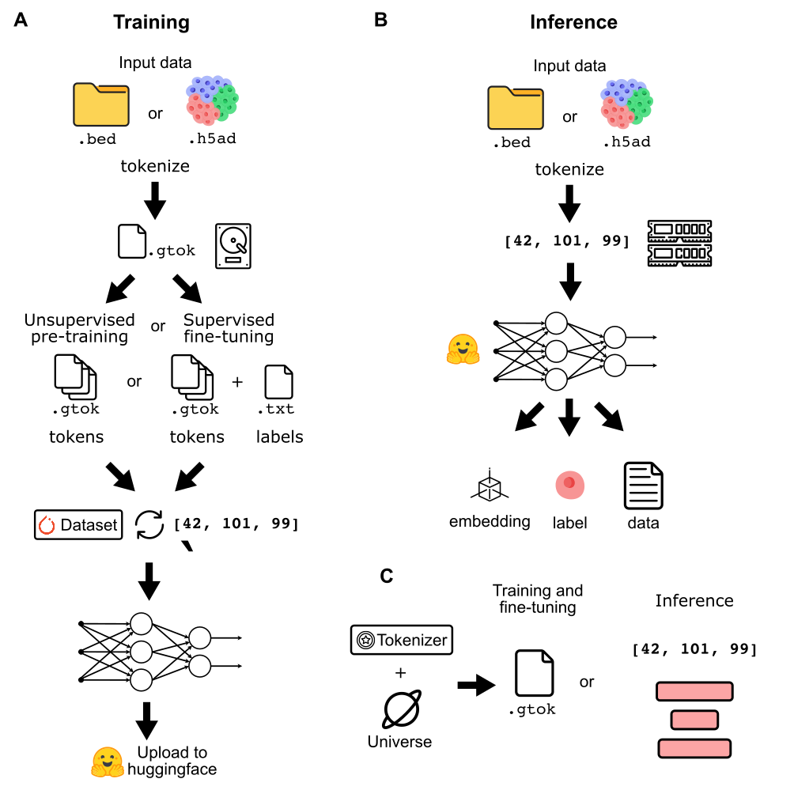

# Genomic datasets with `geniml`

## Overview
Genomic datasets are well known for their incredible size. Therefore, using these for machine learning pipelines requires clever strategies and considerations to effectively handle the large volumes of data. This is particularly problematic when training new models. To that end, `geniml` has two separate workflows for handling genomic data: one for model training and a second for model inference (using a pre-trained model). These workflows have big differences on *when* and *where* genomic datasets are tokenized and stored.

## Model training
Model training, especially pre-training, usually requires large datasets with billions of genomic tokens. These datasets are way too large to fit in memory and therefore must be streamed from disk during training. Because of this, the data must be tokenized "on the fly" for each epoch. This is wildly inefficient and for particularly large datasets, results in the majority of training time being dedicated to tokenization alone. Therefore, the data need be *pre-tokenized* into an intermediate form which can then be streamed in for each epoch. This removes tokenization entirely from the training procedure and therefore increase efficiency (Fig. 1A).

##  Model inference
Model inference is the process of utilizing a pre-trained model to analyze some new, unseen data. While the output of the model might vary (embeddings, label, new data), the input is always the same: genomic tokens. Except under rare circumstances, it's not typical that model inference involves large volumes of data. Therefore, pre-tokenization is *not necessary*. Because of this, data is to be tokenized **in-memory** and directly to the format required to pass through the model (Fig. 1B).

## Tokenization forms
Given the above requirements, tokenizers need to be able to output tokenized genomic data into different forms and locations. For model training: tokenizers should take either bed files or `.h5ad` single-cell datasets and convert them into an intermediary `.gtok` file format. These `.gtok` files will be directly consumed during model training. For model inference: tokenizers should take either bed files or `.h5ad` single-cell datasets and output an in-memory representation of these tokens; typically in the form of a `torch.Tensor` or python list. The following table summarizes the format, location, and scenario in which data is tokenized:


|                 | Where  | What        | When              |
| --------------- | --------- | ------------- | ----------------- |
| Model training  | On disk   | `.gtok` files | Prior to training |
| Model inference | In memory | `torch.Tensors`              | On the fly                  |




## Datasets in `geniml`
`geniml` uses `pytorch` + `lightning` to train models. This ecosystem encourages the use of `torch`s built-in `Dataset` class to parallelize and batch the loading of data. Because training and fine-tuning models requires pre-tokenized data (`.gtok` files), `geniml` needs datasets to handle this. It most likely will look like:
```python
from typing import List

from torch.data.utils import IterableDataset

class PretokenizedDataset(IterableDataset):
	def __init__(self, data: Union[str, List[str]):
		self.data = data
		if isinstance(data, str):
			self._is_folder = True
		elif isinstance(data, list) and isinstance(data[0], str):
			self._is_folder = False
		else:
			raise ValueError("`data` must be a path to a folder or a list of `.gtok` files")

	def __iter__(self, indx: int):
		if self._is_folder:
			for file in os.listdir(self.data):
				with open(file, 'r') as f:
					for line in file.readlines():
						yield line.split(",")
		else:
			for file in self.data:
				with open(file, 'r') as f:
					for line in file.readlines():
						yield line.split(",")
		
```
Here, we are no longer tokenizing each epoch, rather just streaming in data that has already been pre-tokenized. I still need to think about this in the context of fine-tuning and datasets that require targets and labels.